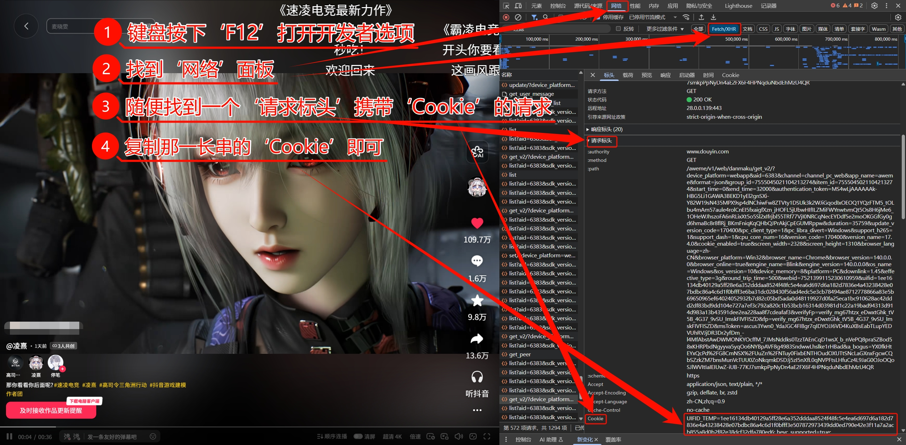

import { Callout } from 'fumadocs-ui/components/callout';
import { Accordion, Accordions } from 'fumadocs-ui/components/accordion';

<Callout type="info">
Cookies 仅用于请求平台官方 API，不会上传到任何第三方。
</Callout>

## 方式一：扫码登录（推荐）

扫码登录暂时只支持抖音与B站。

在群聊中发送：

```
#抖音登录
#B站登录
```

使用对应 APP 扫码即可自动保存 Cookies。

## 方式二：浏览器插件获取（推荐）

使用 Cookie Editor 浏览器插件快速获取 Cookies：

### 安装插件

- **Chrome 浏览器**：[Cookie Editor](https://chromewebstore.google.com/detail/cookie-editor/hlkenndednhfkekhgcdicdfddnkalmdm?hl=zh-CN&utm_source=ext_sidebar)
- **Edge 浏览器**：在 Edge 扩展商店搜索 "Cookie Editor" 并安装

### 使用步骤

1. 打开浏览器，访问对应平台并登录
2. 点击浏览器工具栏中的 Cookie Editor 插件图标打开扩展
3. 点击右下角的 "Export" 按钮（如图中标记 2）
4. 选择 "Header String" 格式（如图中标记 3）
5. 复制生成的完整 Cookie 字符串

<Accordions>
<Accordion title="Cookie Editor 插件使用教程">


</Accordion>
</Accordions>

<Callout type="info">
请确保选择 "Header String" 格式，这样可以获取到完整的 Cookie 字符串形式。
</Callout>

## 方式三：浏览器开发者工具获取

1. 打开浏览器，访问对应平台并登录
2. 按 F12 打开开发者工具（不同浏览器打开方式不同，如 Chrome 和 Edge 按 F12 或右键点击页面选择"检查"）
3. 切换到 Network（网络）标签
4. 刷新页面，找到任意请求
5. 在请求头中复制 Cookie 值

<Accordions>
<Accordion title="视频教程">
<video controls width="100%" style={{ maxHeight: '1000px' }}>
  <source src="/get_Cookies.mp4" type="video/mp4" />
</video>
</Accordion>
<Accordion title="图文教程（Chrome）">



</Accordion>
</Accordions>

## 方式四：移动端获取

使用 <LinkPreview url="https://viayoo.com/zh-cn" className="font-medium text-fd-primary hover:underline">Via 浏览器</LinkPreview>  访问平台网页版并登录：

- 抖音：<LinkPreview url="https://www.douyin.com" className="font-medium text-fd-primary hover:underline">www.douyin.com</LinkPreview>
- B站：<LinkPreview url="https://www.bilibili.com" className="font-medium text-fd-primary hover:underline">www.bilibili.com</LinkPreview>
- 快手：<LinkPreview url="https://www.kuaishou.com" className="font-medium text-fd-primary hover:underline">www.kuaishou.com</LinkPreview>

登录后点击 **左上角菜单** → **查看 Cookies** → **复制文本**

## 配置方式

通过 Karin WebUI 配置，或编辑配置文件：

```yaml title="cookies.yaml"
douyin: 你的抖音Cookie
bilibili: 你的B站Cookie
kuaishou: 你的快手Cookie
xiaohongshu: 你的小红书Cookie
```