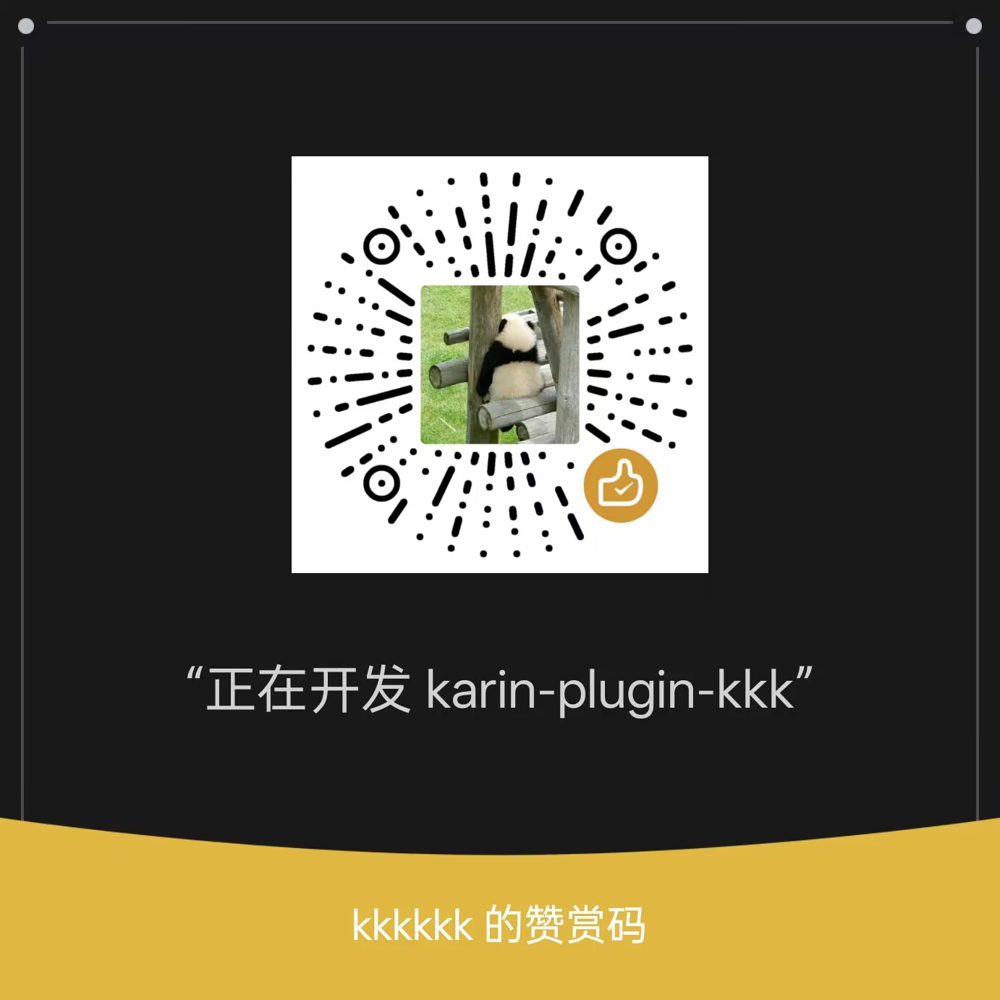

import { Accordion, Accordions } from 'fumadocs-ui/components/accordion';

{/* 流星效果 - 覆蓋整個頁面前景 */}

  <Meteors number={50} />

如果本項目對你有幫助，歡迎前往 [GitHub](https://github.com/ikenxuan/karin-plugin-kkk) 畀個 ⭐ **Star**～

## ☕ 請我飲杯咖啡

開發唔易，如果你覺得呢個項目仲唔錯，可以請我飲杯咖啡，你嘅支持係我持續更新嘅動力 💪

<Accordions type="single">

<Accordion title="微信">

</Accordion>
<Accordion title="支付寶">

</Accordion>
<Accordion title="QQ">

</Accordion>
<Accordion title="愛發電">

</Accordion>

</Accordions>

## 贊助榜

<SponsorList />
