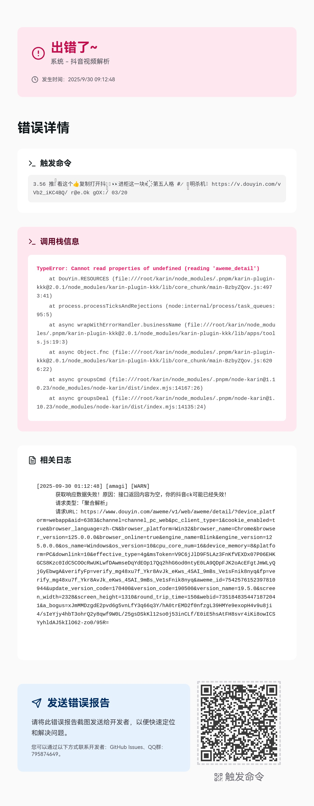

import { Accordion, Accordions } from 'fumadocs-ui/components/accordion';

命令执行出错时，自动捕获异常并渲染错误图片反馈给用户。

## 架构概览

<Mermaid chart={`
flowchart LR
    A[命令触发] --> B[wrapWithErrorHandler]
    B --> C[logger.runContext]
    C --> D[业务逻辑]
    D -->|异常| E[捕获 + 日志收集]
    E --> F[渲染错误图片]
`} />

## 机制特性

### 错误处理包装器

用 `wrapWithErrorHandler` 包装命令处理函数，出错时自动渲染错误图片：

```ts twoslash
// @noErrors
import karin, { type Message } from 'node-karin'
// ---cut-start---
interface ErrorHandlerOptions { businessName: string }
declare function wrapWithErrorHandler(
  fn: (e: Message, next: () => unknown) => Promise<boolean>,
  options: ErrorHandlerOptions
): (e: Message, next: () => unknown) => Promise<boolean>
// ---cut-end---

const handler = wrapWithErrorHandler(
  async (e) => {
    // 业务逻辑，异常会被自动捕获
    return true
  },
  { businessName: '功能名称' }
)

karin.command(/^#命令$/, handler)
```

### 上下文日志追踪

基于 [@karinjs/log4js](https://github.com/KarinJS/esmify/tree/main/packages/log4js) 的 `runContext` API，自动收集执行期间的所有日志，方便排查问题。

```ts twoslash
// @noErrors
import { logger } from 'node-karin'

const ctx = logger.runContext(async () => { /* 业务逻辑 */ })
await ctx.run()
const logs = ctx.logs()  // 获取执行期间的日志
```

## 错误图片示例

<Accordions>
<Accordion title="查看错误日志图片">



</Accordion>
</Accordions>

图片包含：错误类型、调用栈、业务名称、触发命令、执行日志、版本信息。
