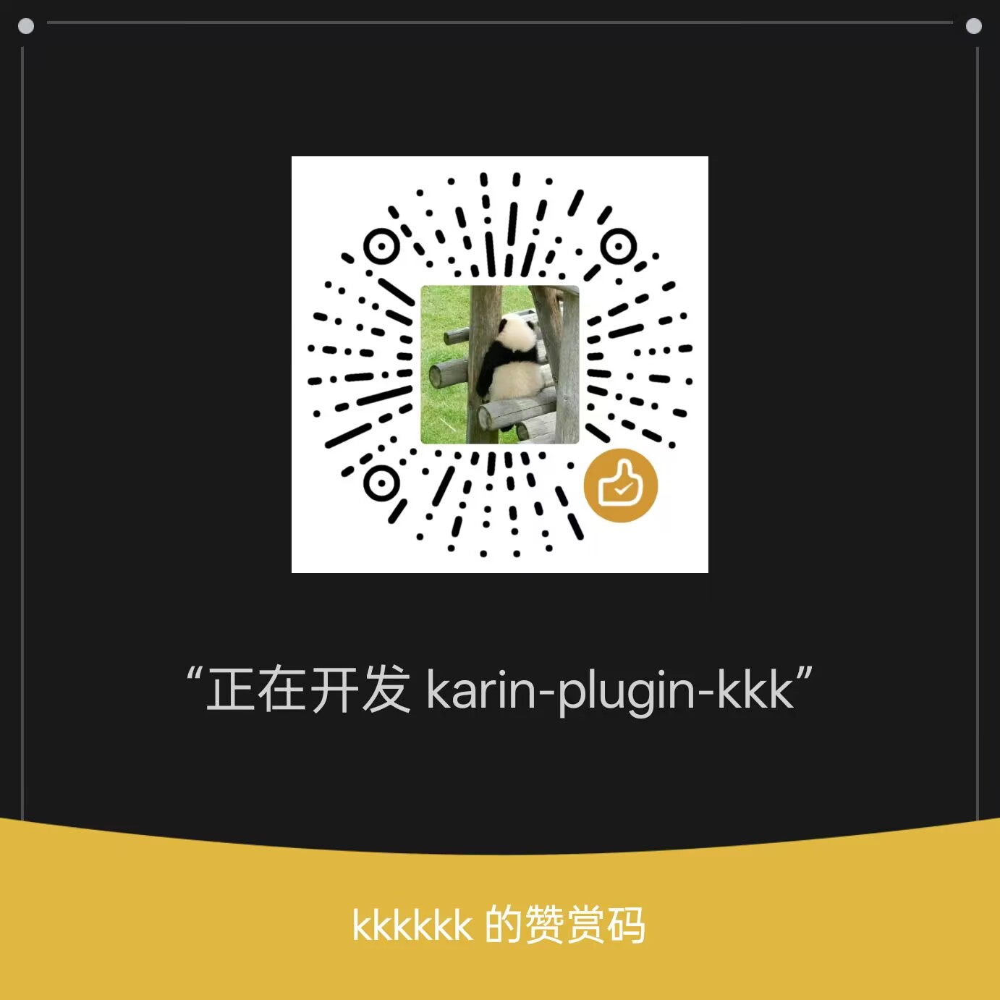

import { Accordion, Accordions } from 'fumadocs-ui/components/accordion'

{/* 流星效果 - 覆盖整个页面前景 */}

  <Meteors number={50} />

如果本项目对你有帮助，欢迎前往 [GitHub](https://github.com/ikenxuan/karin-plugin-kkk) 给个 ⭐ **Star**～

## ☕ 请我喝杯咖啡

开发不易，如果你觉得这个项目还不错，可以请我喝杯咖啡，你的支持是我持续更新的动力 💪

<Accordions type="single">

<Accordion title="微信"></Accordion>
<Accordion title="支付宝"></Accordion>
<Accordion title="QQ"></Accordion>
<Accordion title="爱发电"></Accordion>

</Accordions>

## 赞助榜

<SponsorList />
